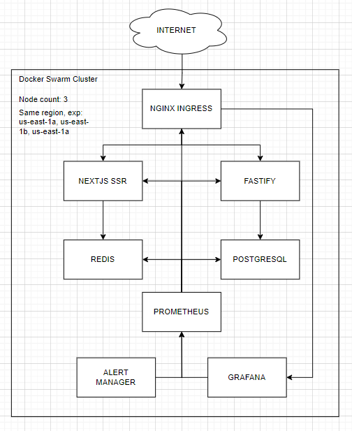

# Zero-One-Group-Skill-Test

This repository has CI/CD system using github action. Github action will trigger if has a change in .github, backend, and frontend directory or if you publish a release this application. Only a release will triggering deploy into target environment.

The build and push container image process is using github action and after successfully build it will deploy into docker swarm

## Requirement

1. Ubuntu 22.04
   terraform and docker installed
   
   docker swarm mode have initiated on this node
   
   required open port 80,443, and 22
   
   has regular user with access to docker socket

   generate ssh key for that user (for remote access), add public key to authorized keys on these user and put the private key as Variable
   
   the server have a public IP
   
2. DockerHub Account
   docker token with access read and write

3. A domain ingress reverse proxy

## Environment Variable

You need to set this on Settings (on this repository) -> Secrets and variable -> Actions

| Variable Name                | Description                                     | Value                         |
| ------------------------------ | ------------------------------------------------- | ------------------------------- |
| DOCKER_USERNAME       | docker username                                 | user123                       |
| BACKEND_SERVICE_NAME   | backend service name                            | node-backend                  |
| BACKEND_DOMAIN        | domain for backend                              | backend.domain.com            |
| BACKEND_URL           | backend url for fronted                         | http://backend.domain.com     |
| SERVER_API_KEY       | backend api key, must same with backend api key, this used for both backend and frontend                         | AAABBBccc                     |
| FRONTEND_DOMAIN      | domain for frontend                             | frontend.domain.com           |
| FRONTEND_SERVICE_NAME | frontend service name                           | node-frontend                 |
| SSH_PRIVATE_KEY              | ssh private key                                 | -----BEGIN OPENSSH            |
| SSH_USER                     | ssh user that have directly access docker sock  | user                          |
| SSH_HOST                     | ssh server public IP                            | 10.10.10.1                    |
| DOCKER_USERNAME              | docker username                                 | user                          | 
| DOCKER_TOKEN                 | docker personal access token with RW access     | JJJ34wudcds                   | 

## Sub Repository

1. backend
   backend application, it writted using fastify
2. frontend
   frontend application, it writted by nextjs with SSR enabled
3. terraform-k8s
   terraform repository for deploying this application (need build the container first) on kubernetes (untested)
4. terraform-swarm
   terraform repository for deploying this application on docker swarm (tested)

## Infrastructure Diagram

## Infrastructure Explanation

The small infrastructure is use container based application. This design is both flexible, scalable, and high availability.

It can easily implement horizontal scaling of swarm services or even node itself. Also it has high available because the swarm cluster running in whole region.

1. Nginx Ingress
   Act as reverse proxy and load balancing, it route the request by domain
2. NextJS with SSR
   Frontend application with SSR enabled
3. Fastify
   The backend application
4. PostgreSQL
   For storing backend data
5. Redis Caching
   It use for caching SSR data on frontend side
6. Prometheus
   Pull all metric in whole infrastructure
7. Grafana
   Visualize metric from Prometheus
8. Alert Manager
   Managing alert rules and routing the alerts
